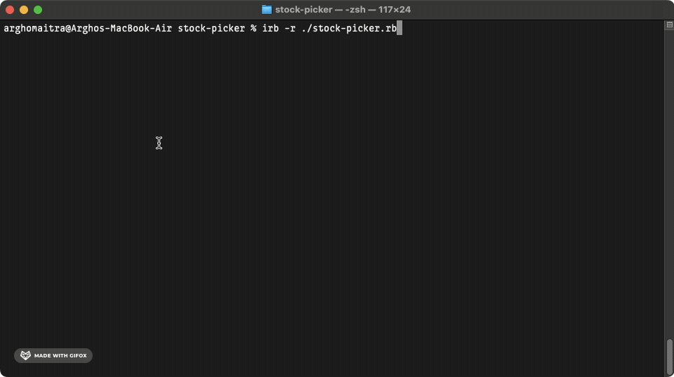

# stock-picker
The Best Day to Buy and Sell Stocks

## Demo

## General Info

**stock-picker** is the [third project](https://www.theodinproject.com/lessons/ruby-stock-picker) in the [Ruby Course](https://www.theodinproject.com/paths/full-stack-ruby-on-rails/courses/ruby) from the [Full Stack Ruby on Rails](https://www.theodinproject.com/paths/full-stack-ruby-on-rails) path in the [The Odin Project](https://www.theodinproject.com/about).

## Technologies

+ ***CLI***
+ ***Git***
+ ***GitHub***
+ ***Ruby***

## Self-reflections

> It took quite some time to reach here. I always keep the stuff I learnt about motivation and mindset in the beginning part of the odin project close to my heart. It has proved valuable in overcoming many of the challenges that I've faced as of now.

> This was actually one of the easiest projects. I learned a whole lot about installing Ruby and all the different basic Ruby tidbits prior to starting this project. The only time spent was brainstorming how to actually find the best day to buy and sell. I believe that the "quick tips" provided are enough to solve this exercise. Take your time and don't ever rush.

## Contact and Support

+ Feel free to contact ***mitrohgr_03505*** on discord for project-related queries.
+ No further feature modifications or improvements will be done to this project.